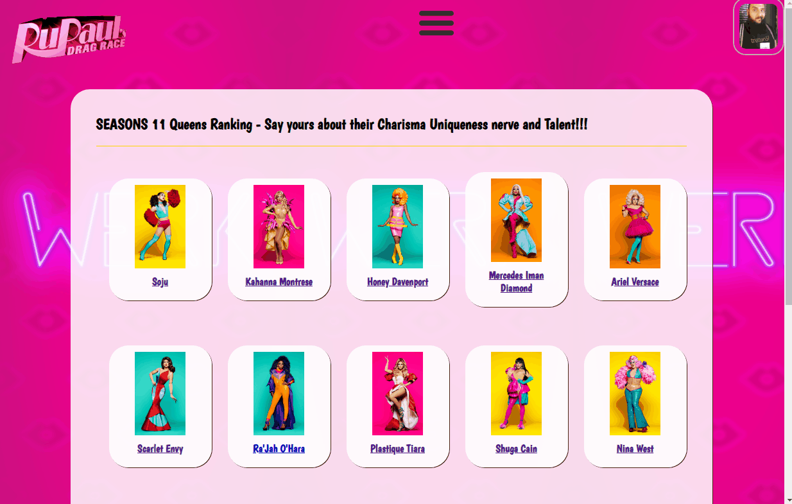

# Rupaul's Drag Race's Social Network

Social Network for geeks of the american show Rupaul's Drag Race

## Overview

In this Project i put together my passion for Drag Race and also the passion for coding, developing a Webapp that displays infos about the past season of the most famous american Reality TV shows, and also offers a small social network part, and some games.

A live preview of the project can be seen at http://dragrace.herokuapp.com

## Techs

Javascript, React, Redux, HTML5, CSS3, Nodejs, PostgreSQL, Socket.io

## Features

#### No-Key No-Shade API based informations:

-   Seasons, Episodes, Drag Queens, Judges, Challenges, Lipsyncs

#### Social Network:

-   Login / Registration
-   Profile Editor
-   Friends Searchbar
-   Friends Page
-   Public Chatroom

#### GAMES:

-   Drag Queen of the last season's evaluator for
    -   Charisma
    -   Uniqueness
    -   Nerve
    -   Talent

with <em>overall</em> Score and <em>local</em> Score

-   Drag Queen Name generator, featuring random Gifs.

## Preview

#### No-Key No-Shade API based informations:

  
 

#### Social Network:

  
 

#### GAMES:

-   Drag Queen of the last season's evaluator for
    

      
     

-   Drag Queen Name generator, featuring random Gifs.
    

      
     

